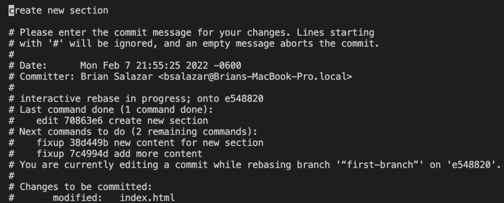

***GIT Guide***

This guide is to better understand most helpful git commands

**Initial Changes**

* Go to Github and create a new repository
* Clone that repository in your documents
* Create an index.html file inside your repo
* Add the following code


```
<!DOCTYPE html>
<html lang="en">
<head>
 <meta charset="utf-8">
 <meta name="viewport" content="width=device-width, initial-scale=1">
 <title>GIT Guide</title>
 <meta name="description" content="A simple page to practice">
</head>

<body>
 <section>
   <p>This is a test</p>
 </section> 
</body>
</html>

```


* Push the changes to main
    * git add .
    * **git commit -m “initial commit”**
    * **git push -u origin main**
        * -u = -set-upstream

**Stash - When you need to save your changes without committing or you need to move to another branch without losing changes you can use git stash**


* create a new branch
    * **git checkout -b “first-branch”**
        * -b = git branch + git checkout
* Add another two paragraphs after the first one


```
 <section>
   <p>This is a test</p>
   <p>This is a test1</p>
   <p>This is a test2</p>
 </section> 
```


 


* Save your code
    * **git stash**
        * git stash = git stash push 
* Look stashed code
    * git stash list(you can have have more than one but becomes complicated)
    * git stash show
* Return your saved code
    * git stash apply or git stash pop
        * pop remove the the saved code
        * apply leaves the code if you want to use it later
* Commit current changes
    * git add .
    * git commit -m “add two new paragraph”

**Revert - When you want to remove a commit without modifying the git history, creating a new commit to revert the changes, you can use git revert**


* Create another paragraph and create another commit
    * git add .
    * git commit -m “add another p”
* Revert the changes of the last two commit
    * **git revert --no-commit HEAD~2..**
        * Revert create a new commit removing changes for the commits
        * –no-commit =  avoid to automatically create the commit, so you have to create a new commit 
        * HEAD points to the current commit
        * HEAD~2.. = HEAD~2..HEAD = remove the commits in that range
        * Is safe than reset since reset don't modify the history
        * There are multiple ways to do it [https://git-scm.com/docs/git-revert](https://git-scm.com/docs/git-revert) 
    * git commit -m “revert multiple commits”

**Reset - When you want to remove a commit or comeback to a specific commit but modify git history to locate before you created that commit you can use git reset**


* Let's come to the first commit of this new branch removing all the other commits
* Search for the id of the commit that we want
    * **git log**
        * Select the first commit in the branch In my case e548820a8753925951562e05d43a34976c1c59d7
* Now let's jump to that commit
    * **git reset –hard e548820a8753925951562e05d43a34976c1c59d7**
        * This is one of the most dangerous commands
        * Reset remove all the other commits and modify the history
        * –hard = remove all the unstaged changes and everything
        * There are multiple ways to do it [https://git-scm.com/docs/git-reset](https://git-scm.com/docs/git-reset)  
    * git log
        * now you should have just one commit in the current branch

**Squash - When you want to merge several commits into one you can use squash, it can also be combined with other git rebase interactive commands to for example change the name of the final commit**


* Lets create a new section after the current section


```
<section>
   <h2>New Section</h2>
 </section>

```


* Commit current changes
    * git add .
    * git commit -m “create new section”
* Let's add more content to the new section


```
<p>some text for the new section</p>

```


* Commit current changes
    * git add .
    * git commit -m “create new content for new section”
* Let's add last commit for that section


```
<p>more content</p>

```


* Commit current changes
    * git add .
    * git commit -m “create new content for new section”
* Push your changes
    * git push --set-upstream origin “first-branch”
* Now will make just one commit for all the code from that section
* lets select the previous commit to this section, so “add two new paragraph” commit
* Use git log and select the id, e548820a8753925951562e05d43a34976c1c59d7 in my case


* we are going to use git rebase interactive to squash the section changes in one commit
    * git rebase -i e548820a8753925951562e05d43a34976c1c59d7
* You will be in a vim console with your commits after the selected one


* You can use any of those commands, but we are going to use two, because we can combine some of those, so we are going to use edit = e(to use amend to change the commit) and fixup = f(similar to squash The difference between squash and fixup is that during the rebase, the squash operation will prompt you to combine the messages of the original and the squash commit, whereas the fixup operation will keep the original message and discard the message from the fixup commit.)
* so since we are using vim need to press “i” to insert text, so lets change the first pick to an e to amend that commit and use a new one, and change the other two pick for a f to squash those commits


* so more commands from vim, press “ESC” to leave the insert mode and then “:wq” and “enter” to save your changes
* You will see something like this:


* Run git commit —amend to change the commit message
* You will see another vim window, so same thing press “i” to enter in insert mode, change the commit message, “create new section” for “create second section” in my case and press “ESC” then “:wq” and “enter”





* Lets use git status


* git rebase –continue if you want to continue with the rebase
* you can do git logm and you will see just two commits


* Now lets use git status, you will see, you have a branch diverged, that means that now you have just one commit in you local but 3 in you upstream, thats is because your squash


* So you need to push your changes but forcing your changes, but before do that make sure all is working on your local since with force you will be overwritten your changes in the upstream
    * git push —force

**Cherry Pick - When you want to replicate the changes made in a commit you can use cherry pick to apply those changes in other branches**


* now lets use git log again to copy the id of the first commit “add two new paragraph” in this branch to use it later with cherry pick, in my case e548820a8753925951562e05d43a34976c1c59d7
* lets move to main branch
    * git checkout main
* create another branch
    * git checkout -b second_branch
* Go to github and create a pull request for the first branch 


* Then squash and merge the PR


* Now in the second branch we are going to apply the first commit form the first branch with cherry pick using the id we save before
    * git cherry-pick e548820a8753925951562e05d43a34976c1c59d7
        * This will be applying the commit in the current branch, so you will see the other two paragraph already added in this branch
* Now move to main branch
    * git checkout -
        * with just the “-” we will go to the previous branch

**Updating main branch**


* Now you are going to see just one paragraph, this is because we need to update our local main branch with the changes in the repo
    * git fetch
    * git pull -–rebase
        * —rebase is to avoid merges commit, since our workflow is almost with separate pages we mostly working with rebase to avoid keep our branches clean

**Updating Other branches with main branch changes**


* Now you will have all the changes from main branch, so now lets move to second branch
    * git checkout -
* Now we also need to update the second branch since we just have the first commit that we apply with the cherry pick, so for that we are going to rebase the changes from main branch
    * git rebase main
* Now you will have some conflicts since you have changes in the same file


* Just accept the current changes in this case, but in a real situation you need to choose between current or incoming changes
    * current changes in this case are changes from main branch
* After accept current changes, you need to stage your changes
    * git add .
* Then continue with the rebase
    * git rebase –continue

**commit –fixup - If you need to apply related changes to a previous commit you can use commit --fixup to add new changes to previous commits, it works together with git rebase --autosquash**


* Now create two more commits just adding two more paragraph
    * add a paragraph
    * git add .
    * git commit -m “add more content”
    * add another paragraph
    * git add .
    * git commit -m “add last content”
* Now let's say that we want want to add something else in the previous commit “add more content”, we can do that, so add another paragraph or div with some content and then
    * git add .
    * git log 
        * to search the id of the commit where you want to include this new content, 2062dae3709c518f3b515373e3608939edaba619 in my case
    * git commit –fixup 2062dae3709c518f3b515373e3608939edaba619

**Git Rebase –autosquash - You can use git rebase --autosquash to merge commits that were generated with --fixup to the base commits to limber the branch and leave only the base commits with the new changes**


* Now let's join that commit with a rebase interactive
    * git log
        * to search for the commit id previous to the commits you want to rebase, can be the previous to the first commit on this branch
    * git rebase -i –autosquash 2fb5613e586132010b7a3bd6dca21bbff1b78e60
    * With –autosquash the vim changes should be good so just do “:wq” but if you want you can do some other changes 
    * Resolve the conflict and do
        * git rebase –continue 
